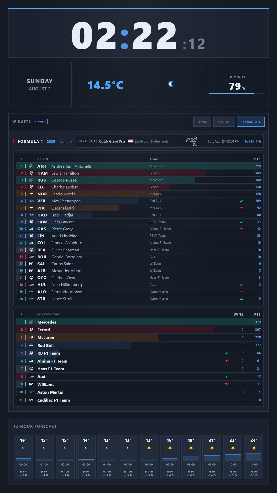
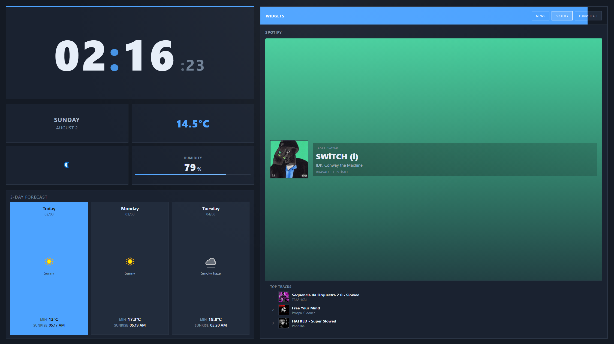
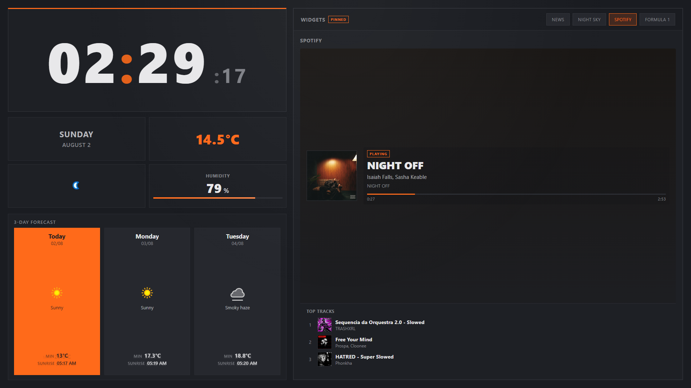
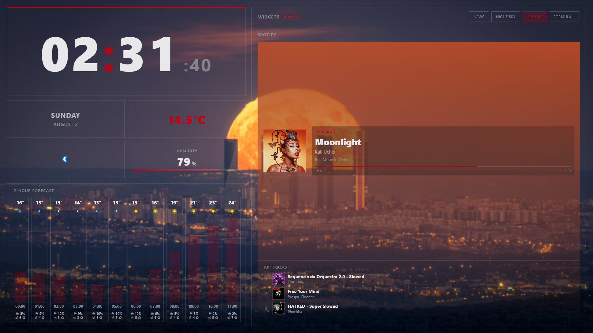
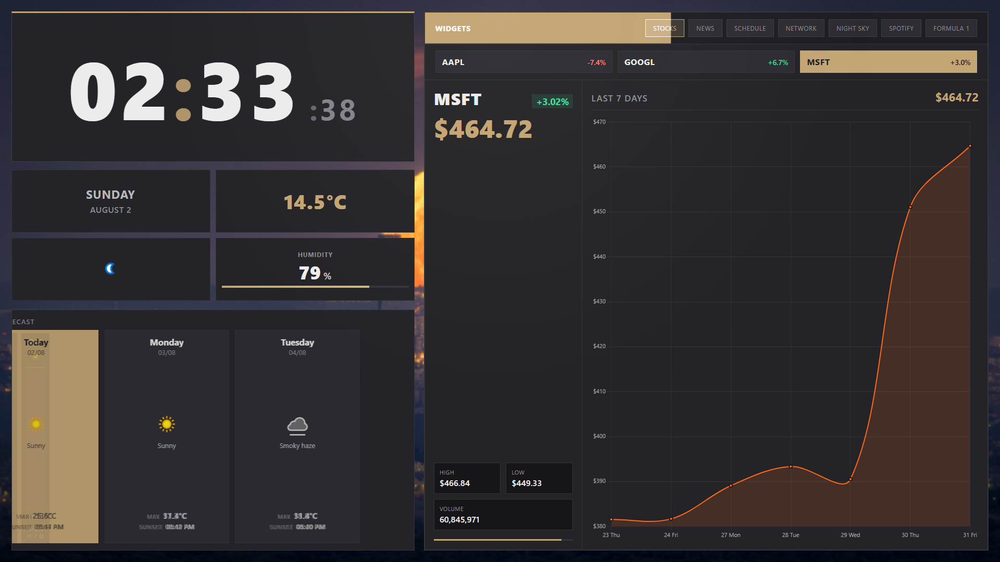
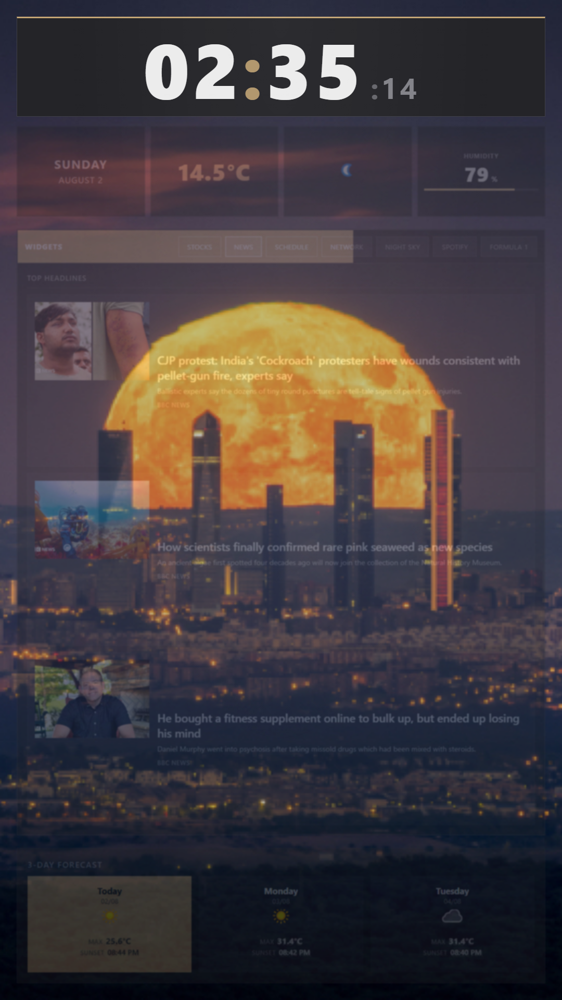
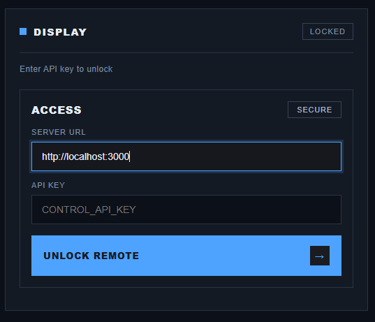
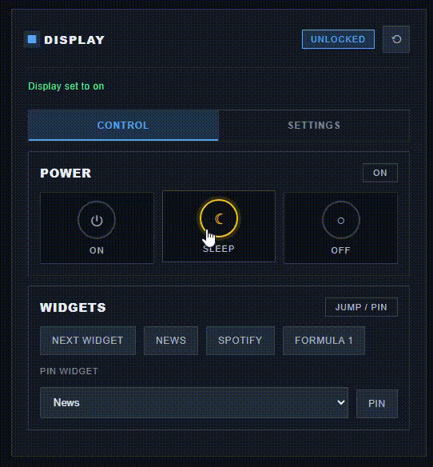

# DisplayProject

Widget-style dashboard for a **portrait 9:16** secondary monitor (1080×1920 — a rotated 16:9 / 1920×1080 panel), with weather, stocks, news, and a daily timetable. Controlled remotely via a web PWA and Alexa skill.


## What this is

DisplayProject turns a spare portrait monitor into an always-on information wall: clock, weather, stocks, news, calendar, Spotify, Formula 1, and more that allows you to control from  your phone or Alexa without walking over to the screen. API keys stay on the server, the UI updates over WebSockets in real time, and appearance (colour schemes, transparent panels, backgrounds) is tunable so it looks like *your* desk display, not a generic dashboard.

## Features

- Live clock and current weather
- 3-day and hourly forecast views
- Rotating widgets: stocks, news, timetable (Google Calendar), network, night sky, Spotify, Formula 1
- Backend API proxy (API keys stay server-side)
- Remote control page at `/remote` (API-key unlock + dashboard settings)
- Widget pin from remote (choose a widget and freeze auto-rotation until cleared)
- WebSocket updates for display power, widgets, and settings
- Raspberry Pi kiosk install with HDMI power control
- Optional Go analytics microservice (API latency + widget views; remote Analytics tab)
- Alexa skill stub in [`alexa/`](alexa/)

## Screenshots

Portrait Formula 1 standings (driver + constructor championships, next race strip, 12-hour forecast):



Landscape Spotify widget with album-colour panel background:



Custom orange accent colour scheme:



Transparent surfaces over a custom background image:



Stocks widget with 7-day chart:



Night / focus mode with transparent UI over a full-bleed background:



Remote control: unlock screen:



Remote control: power, widgets, and settings:



## Prerequisites

- Node.js 18+
- A portrait **1080×1920** display (rotated 16:9). Landscape still letterboxes as a fallback for development.
- API keys from [WeatherAPI](https://www.weatherapi.com/), [NewsAPI](https://newsapi.org/), and [Alpha Vantage](https://www.alphavantage.co/)
- Optional: Google Cloud OAuth client for the Schedule widget (see [Google Calendar](#google-calendar-schedule-widget))

## Setup

1. Install backend dependencies:

```bash
cd backend
npm install
```

2. Install client dependencies:

```bash
cd client
npm install
```

3. Configure environment:

```bash
cp .env.example .env          # in backend/
cp .env.example .env          # in backend/client/
```

Fill in API keys in `backend/.env`. The client only needs `REACT_APP_LOCATION` (optional).

For the Night Sky widget, add `ASTRONOMY_APP_ID` and `ASTRONOMY_APP_SECRET` from [AstronomyAPI](https://astronomyapi.com/). The star chart and visible planets/Moon both use AstronomyAPI.

**Important:** If this repo was ever public with committed keys, rotate them at each provider.

## Google Calendar (Schedule widget)

The Schedule widget loads today’s events from Google Calendar via the backend. Tokens stay server-side.

1. In [Google Cloud Console](https://console.cloud.google.com/), create a project (or pick one).
2. Enable **Google Calendar API**.
3. Create **OAuth client ID** → application type **Desktop app**.
4. Copy the Client ID and Client Secret into `backend/.env` as `GOOGLE_CLIENT_ID` and `GOOGLE_CLIENT_SECRET`.
5. While the OAuth app is in Testing mode, add your Google account as a test user.
6. From `backend/`, run the one-time auth script:

```bash
cd backend
node scripts/google-calendar-auth.js
```

7. Open the printed URL, grant **readonly** calendar access, then paste `GOOGLE_REFRESH_TOKEN=...` into `backend/.env`.
8. Optionally set `GOOGLE_CALENDAR_ID` (default `primary`).

Restart the server. The Schedule widget will show today’s events (or a connect message if env vars are missing).

To force a new refresh token, revoke the app at [Google Account permissions](https://myaccount.google.com/permissions) and run the auth script again.

## Spotify (Now Playing widget)

The Spotify widget shows what is playing now (or the last played track), plus your top 3 short-term tracks (Spotify’s ~4-week window).

1. Create an app in the [Spotify Developer Dashboard](https://developer.spotify.com/dashboard).
2. Add redirect URI `http://127.0.0.1:3006/callback` (Spotify rejects `localhost`; loopback HTTP is allowed).
3. Copy Client ID and Client Secret into `backend/.env` as `SPOTIFY_CLIENT_ID` and `SPOTIFY_CLIENT_SECRET`.
4. From `backend/`, run:

```bash
cd backend
node scripts/spotify-auth.js
```

5. Paste `SPOTIFY_REFRESH_TOKEN=...` into `backend/.env` and restart the server.
6. Enable **Spotify** under Enabled widgets on the remote.

While a track is playing, the dashboard can show **synced lyrics** as a soft background overlay (line timing from [LRCLIB](https://lrclib.net/), matched to Spotify progress). Coverage depends on LRCLIB — instrumentals and unmatched tracks show no lyrics. Toggle **Spotify → Lyrics background** under Appearance on the remote (on by default).

## Formula 1 (championship + live timing)

The Formula 1 widget shows the driver and constructor championships side by side, under a strip naming the next race and how far away it is. That strip also shows the host country's flag and a small circuit outline. Arrows mark movement since the previous round, and constructor rows carry team logos. While a session is running, the left column switches to the live race order with gaps, lap count, and track status, and the arrows show places gained or lost against the starting grid.

Team logos, circuit maps, and flags are proxied through `/api/f1/logo/:constructorId`, `/api/f1/circuit/:circuitId`, and `/api/f1/flag/:country` and cached in memory for a week, so the display keeps working if an upstream path moves; a missing asset simply leaves that slot empty.

**Championship standings need no configuration.** They come from [Jolpica](https://github.com/jolpica/jolpica-f1), the community-maintained successor to the Ergast API, and are cached for 30 minutes to stay well inside its rate limit.

**Live timing is an unofficial feed** and is best-effort. The backend watches `livetiming.formula1.com/static/StreamingStatus.json` and only opens a connection while a session is actually live. Two optional settings in `backend/.env`:

- `F1_LIVE_ENABLED=false` disables the live feed entirely; the widget then only ever shows championships.
- An F1 account token. F1 moved this feed to SignalR Core and it usually expects one; without a token the feed may return partial data or nothing at all. See [Getting an F1 live token](#getting-an-f1-live-token) below.

If the live feed is unavailable for any reason, the widget silently falls back to championship standings — no configuration is required for it to be useful.

### Getting an F1 live token

A **free F1 account is enough** — an F1 TV subscription is only needed for car telemetry streams, which this dashboard does not use.

F1's sign-in is anti-bot protected, so there is no headless username/password flow. What does work is signing in once in a real browser and keeping that browser profile: F1 keeps the session alive far longer than the ~4 day token inside it, so re-opening the site with the same profile mints a fresh token.

Sign in once (opens a visible browser; complete the login there):

```bash
cd backend
npm install --no-save playwright   # Playwright drives the browser
node scripts/f1-auth.js --login
```

From then on, renew without any interaction:

```bash
node scripts/f1-auth.js --refresh
```

The token is written to `backend/data/f1-token.json`, which a running server re-reads on its next connection attempt — **no restart needed**. `--status` prints the current expiry, and `--refresh` exits non-zero when the saved session has lapsed and you need to run `--login` again.

Both files are gitignored: the token is a credential, and the browser profile holds a live F1 session.

To renew automatically on a Raspberry Pi, install the daily timer (it uses the system Chromium the kiosk already has, since Playwright ships no Raspberry Pi browser build):

```bash
bash scripts/raspberry-pi/install.sh --with-f1-token-refresh
cd ~/DisplayProject/backend && node scripts/f1-auth.js --login   # once, on the Pi desktop
```

Check on it with `systemctl list-timers displayproject-f1-token` and `journalctl -u displayproject-f1-token`.

**Without a browser**, paste the cookie by hand instead: sign in at [formula1.com](https://www.formula1.com), open DevTools → Application → Cookies → `https://www.formula1.com`, copy the value of the `login-session` cookie, and run `node scripts/f1-auth.js` with no arguments. It extracts `data.subscriptionToken` and stores it the same way; a bare JWT can be pasted instead of the cookie. You can also set `F1_LIVE_TOKEN` in `backend/.env`, which is used as a fallback when no token file exists.

**Tokens last roughly four days.** When one lapses, the negotiate call fails, the server logs it once, and the widget falls back to championship standings until a fresh token appears.

Enable **Formula 1** under Enabled widgets on the remote.

## Production run

Build the client and start the server on port 3000:

```bash
cd backend
npm run build:client
npm start
```

Open `http://localhost:3000` on your display monitor.

## Development

Run the API server on port **3001** and the React dev server on port **3000** (with proxy):

```bash
# Terminal 1
cd backend
npm run dev:server

# Terminal 2
cd backend
npm run dev:client
```

## Raspberry Pi (kiosk display)

Run DisplayProject on **Raspberry Pi OS (desktop)** as a dedicated HDMI dashboard: Node starts on boot, Chromium opens fullscreen, and remote Sleep/Off turns the HDMI output off.

### Requirements

- Raspberry Pi 4 or 5 (recommended)
- Raspberry Pi OS 64-bit with desktop
- HDMI monitor
- Node.js 20+ (`node -v`)

### Install

```bash
git clone <your-repo-url> ~/DisplayProject
cd ~/DisplayProject
cp backend/.env.example backend/.env   # add API keys + CONTROL_API_KEY
bash scripts/raspberry-pi/install.sh
sudo reboot
```

The installer will:

- Install production backend dependencies and build the React client
- Enable a `displayproject` systemd service (auto-restart on boot)
- Install HDMI power control at `/usr/local/bin/displayproject-display-power`
- Install brightness control at `/usr/local/bin/displayproject-display-brightness`
- Add a desktop autostart entry that launches Chromium in kiosk mode

### After reboot

- **Dashboard:** opens automatically in fullscreen on the HDMI monitor
- **Remote from phone:** `http://<pi-ip>:3000/remote` (same Wi‑Fi network)

Find the Pi IP:

```bash
hostname -I
```

Use that IP in the remote page’s Server URL field, plus your `CONTROL_API_KEY`.

### Optional: build on another machine

Building React on a Pi can take several minutes. You can build elsewhere and copy the output:

```bash
# On your PC
cd backend && npm run build:client

# Copy backend/client/build/ to the Pi, then on the Pi run install.sh
# (it will still rebuild unless build/ already exists — skip client build by
#  running only the systemd/kiosk steps from install.sh manually if needed)
```

### Troubleshooting

| Issue | What to try |
|---|---|
| Service not running | `sudo systemctl status displayproject` |
| Server logs | `journalctl -u displayproject -f` |
| Health check | `curl http://127.0.0.1:3000/api/health` |
| Kiosk not opening | Log out/in or reboot; check `~/.config/autostart/displayproject-kiosk.desktop` |
| HDMI won't wake | `displayproject-display-power on` |
| Brightness unchanged | `displayproject-display-brightness 70`; for HDMI monitors install `ddcutil`; ensure `DISPLAY=:0` for xrandr |
| Phone can't connect | Confirm Pi IP, same network, and `HOST=0.0.0.0` in `backend/.env` |

Disable screen blanking in Pi OS desktop preferences as an extra safeguard against the monitor sleeping.

## Analytics (optional)

A small Go microservice records API response times and widget views in SQLite, then exposes a 24-hour summary for the remote **Analytics** tab (most viewed widget, busiest hour, slowest API, plus chart series). The Node backend posts events and proxies the summary — the remote never talks to Go directly.

```bash
cd analytics
go run ./cmd/analytics
```

In `backend/.env` set `ANALYTICS_URL=http://127.0.0.1:3010` (the default). Set `ANALYTICS_URL=false` to disable. Details: [`analytics/README.md`](analytics/README.md). Safe to skip on a Pi if you do not need the tab — the dashboard keeps working when the service is down.

Charts on the remote Analytics tab are a small Vite/React island ([Bklit](https://bklit.com/) via shadcn). Build once after clone or when changing chart UI:

```bash
cd backend/remote-analytics
npm install
npm run build
```

Or from `backend/`: `npm run build:remote-analytics` (after `npm install` in `remote-analytics`). Output lands in `backend/remote/analytics-app/` and is served under `/remote/analytics-app/`.

## Remote control

1. Start the server
2. Open `http://localhost:3000/remote` (or `http://<pi-ip>:3000/remote` from another device)
3. Enter your `CONTROL_API_KEY` from `backend/.env` and tap **Unlock**
4. Use On / Sleep / Off, widget jump buttons, and **Pin widget** (pick which widget to freeze; **Unpin** or **Next Widget** clears the pin)
5. Open the **Analytics** tab for the last-24h summary and charts (requires the Go service above; build remote-analytics once as documented in Analytics)
6. Under **Dashboard Settings**, change location, stocks, widgets, rotation, news, calendar, background, appearance (including **colour scheme** — presets or **Custom** with accent/app/panel/card pickers and optional transparent surfaces; **clock size** and **clock font size**; applied to both the dashboard and this remote page — night focus schedule and **display brightness** — on a Raspberry Pi this drives the panel/HDMI backlight via `displayproject-display-brightness`), and layout, then **Save settings**

Enable **Night Sky** under Enabled widgets to show the AstronomyAPI chart and visible planets/Moon strip. Enable **Spotify** after completing the Spotify setup above. Enable **Formula 1** for championship standings and live race order.

The remote page stays locked until the API key is verified. Lock the session when finished. Settings are stored in `backend/data/settings.json` (not committed).

Install as a PWA on Android for a simple remote control app.

## API endpoints

| Endpoint | Description |
|---|---|
| `GET /api/health` | Health check |
| `GET /api/weather/current` | Current weather |
| `GET /api/weather/forecast` | 3-day forecast |
| `GET /api/weather/hourly` | Hourly forecast |
| `GET /api/stocks?symbols=AAPL,GOOGL,MSFT` | Stock data (cached, rate-limited) |
| `GET /api/news?category=general` | News headlines |
| `GET /api/calendar/events?days=1` | Today’s Google Calendar events (503 if not configured) |
| `GET /api/network/stats` | Connection latency + local NIC rx/tx rates (light probe, cached ~15s) |
| `GET /api/sky/current` | Night sky chart URL + bodies above horizon (cached ~45m) |
| `GET /api/spotify/now` | Now playing / last played + top tracks (503 if not configured) |
| `GET /api/f1/standings` | F1 driver + constructor championships with round-over-round movement, next race, plus live race order when a session is running |
| `GET /api/f1/logo/:constructorId` | Constructor logo, proxied from F1's media CDN and cached for 7 days (404 if unknown) |
| `GET /api/f1/circuit/:circuitId` | Next-race circuit map outline, proxied from F1's media CDN and cached for 7 days |
| `GET /api/f1/flag/:country` | Country flag for the next race (Jolpica country name), proxied from flagcdn and cached for 7 days |
| `GET /api/settings` | Dashboard preferences (location, widgets, stocks, etc.) |
| `PUT /api/settings` | Update preferences (requires `x-api-key`); broadcasts `settings:update` |
| `GET /api/analytics/summary` | Last-24h analytics summary from the Go service (requires `x-api-key`; empty/offline fallback if unreachable) |
| `POST /api/analytics/event` | Dashboard widget-view beacon (`{ type: "widget_view", widget, source? }`) |
| `GET /api/display/state` | Display state (includes `pinned`) |
| `POST /api/display/auth/verify` | Validate `CONTROL_API_KEY` for remote unlock |
| `POST /api/display/power` | `{ action: "on" \| "off" \| "sleep" }` (requires `x-api-key`) |
| `POST /api/display/widgets/rotate` | Next widget; clears pin (requires `x-api-key`) |
| `POST /api/display/widgets/set` | Jump to widget index (requires `x-api-key`) |
| `POST /api/display/widgets/pin` | `{ pinned: true \| false, index? }` freeze rotation on a chosen widget (requires `x-api-key`) |
| `WS /ws/display` | Real-time display events |

## Alexa

See [`alexa/README.md`](alexa/README.md) for skill setup.

## Tests

```bash
cd backend && npm test
cd backend/client && npm test
```

### E2E (Playwright)

```bash
cd backend
npm run build:client   # once / after UI changes
npx playwright install chromium
npm run test:e2e
```

Uses an isolated settings file (`DISPLAY_SETTINGS_PATH`) and stubs weather/stocks/news so live API keys are not required. In CI, Chromium is installed with OS deps and the client is already built before `npm run test:e2e`.
